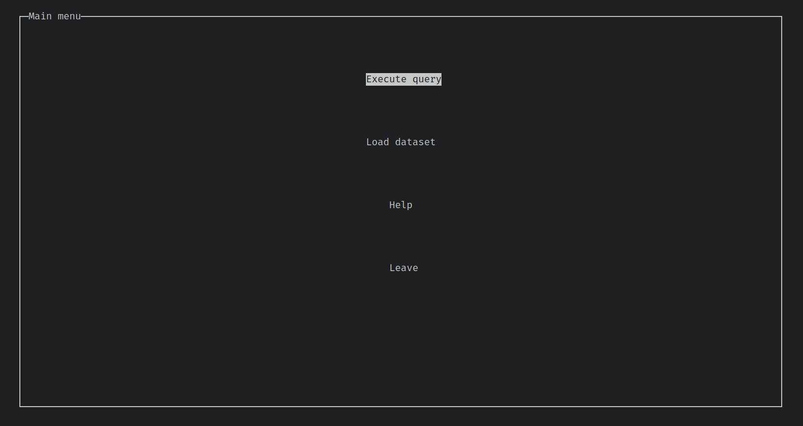
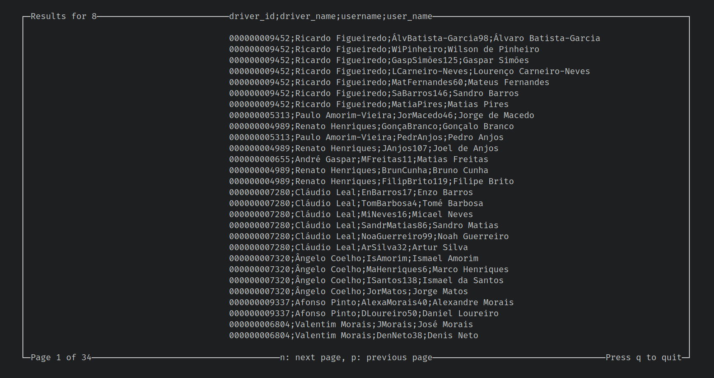

# Uber Manager

## Software Labs III | Laboratórios de Informática III
## Grade: 18/20 :star:

This project was developed during the first semester of the 2nd year of the Software Engineering degree @ University of Minho.

The project consisted of recreating a simplified version of the Uber database. It is important to refer that the whole database is stored in memory, so it is not persistent. The main goal of learning how to apply some OOP principles, such as encapsulation and modularity. It was also a good opportunity to learn how to use some data structures, such as Hash Tables and AVL Trees.

The project has two main modes:
- __Batch__: In this mode, the program reads a file with a list of commands and executes them. The commands consist of query-like commands, such as "2 10", which stands for "top 10 drivers by average rating".

- __Interactive__: In this mode, the program reads the user's input and executes the command. The commands are the same as the batch mode, but the user can input them directly on the terminal. We used ncurses to create a simple interface for the user. You can preview it below:

Main menu



Query result pagination (the user can navigate through the results using some keyboard shortcuts)



## Installing and running the project

Firstly, you will need to install some dependencies such as [glib2](https://docs.gtk.org/glib/) and [ncurses](https://invisible-island.net/ncurses/).

#### Ubuntu
```bash
$ sudo apt-get install libglib2.0-dev libncurses5-dev
```

#### Arch Linux
```bash
$ sudo pacman -S glib2 ncurses
```

#### Fedora
```bash
$ sudo dnf install glib2 ncurses
```

#### Cloning the repository
```bash
$ git clone git@github.com:ruilopesm/Uber-Manager-LI3.git
```

#### Compiling
```bash
$ cd Uber-Manager-LI3
$ make
```

#### Running
```bash
$ ./programa-principal <path to *.csv files> <path to input file>
```

# Developed by:

- [Rui Lopes](https://github.com/ruilopesm)
- [Daniel Pereira](https://github.com/danielsp45)
- [Duarte  Ribeiro](https://github.com/DuduWater12)
